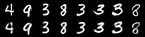
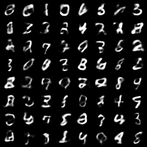
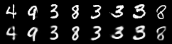
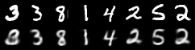
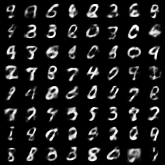
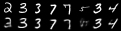
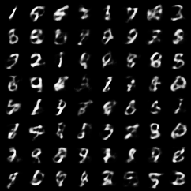

# Bayesian Deep Learning with torch distributions
This repository contains basic examples of [pytorch `distributions`](https://pytorch.org/docs/stable/distributions.html) package.
The `distributions` package is pytorch adaptation of [tensorflow `distributions`](https://arxiv.org/abs/1711.10604) which implements
building blocks for Bayesian Deep Learning. To read more about the examples in this
repository, you can read my blog [here]().

**Installation**
```
pip install -r requirements.txt
```

### Basic VAE setup
Borrowed as it is from [pytorch repo](https://github.com/pytorch/examples/tree/master/vae).
It is implementation of the paper [Auto-Encoding Variational Bayes](https://arxiv.org/abs/1312.6114) by Kingma and Welling.


**Usage**
```
python vae.py
...
...
...
====> Epoch: 10 Average loss: 106.3110
====> Test set loss: 105.5890
```

**Reconstructed samples**

Some sample reconstructions from the basic VAE (trained for 10 epochs on MNIST)  



**Generated Samples**

We can also generate some sample digits from the basic VAE by providing random numbers
generated from a normal distribution as input.




We will use this example as template for rest of the code.

### Gaussian example

We'll construct the exact same example using using `distributions` package now.
We'll need to modify very little code. Notice the changes in `forward` and `loss_function`. 

```
python gaussian_vae.py
...
...
...
====> Epoch: 10 Average loss: 106.3209
====> Test set loss: 105.6140
```

**Reconstructed samples**

Some sample reconstructions from the basic VAE (trained for 10 epochs on MNIST)  



**Generated Samples**


### Benoulli example

We can make our latent representation bernoulli by using [relaxed bernoulli](https://pytorch.org/docs/stable/_modules/torch/distributions/relaxed_bernoulli.html#RelaxedBernoulli)
distribution. The file `binconcrete.py` contains implementation with bottleneck layer of size 20.

```
python binconcrete.py
...
...
...
====> Epoch: 10 Average loss: 126.6666
====> Test set loss: 125.3123
```

**Reconstructed samples**

Some sample reconstructions (trained for 10 epochs on MNIST)  



**Generated Samples**




### Categorical Example
Similar to the bernoulli example, a more general usecase is when the latent dimension is
categorical. 


```
python concrete.py
...
...
...
====> Epoch: 10 Average loss: 110.2161
====> Test set loss: 109.1930
```

**Reconstructed samples**

Some sample reconstructions (trained for 10 epochs on MNIST)  



**Generated Samples**



For more details on relaxed bernoulli or relaxed categorical distributions, please refer
to the following papers

[1] "Categorical Reparameterization with Gumbel-Softmax" - 
Eric Jang, Shixiang Gu, Ben Poole - https://arxiv.org/abs/1611.01144

[2] "The Concrete Distribution: A Continuous Relaxation of Discrete Random Variables" -
 Chris J. Maddison, Andriy Mnih, Yee Whye Teh - https://arxiv.org/abs/1611.00712